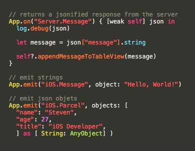

```Pacific``` is a set of frameworks thoughtfully aggregated into in a single wrapper to help bootstrap iOS apps and allow for faster prototyping and design.

Namely, the frameworks used are as follows...

## Http ~ [```Alamofire```](https://github.com/Alamofire/Alamofire) & [```SwiftyJSON```](https://github.com/SwiftyJSON/SwiftyJSON)


## Logging ~ [```Atlantis```](https://github.com/DrewKiino/Atlantis) 


## Persistent Data ~ [```Pantry```](https://github.com/nickoneill/Pantry)


## Sockets ~ [```Socket.IO```](https://github.com/socketio/socket.io-client-swift)




# Setup

``` Swift
pod 'Pacific'
```

# Author
Andrew Aquino, [TotemV.LLC](http://totemv.com/)
