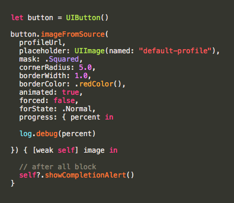

First off, *super mega fucking props* to the people who made these awesome libraries, and second, some of these were made personally by me as well!

```pod 'Pacific'```

# Pacific

```Pacific``` is a set of frameworks and libraries thoughtfully aggregated into in a single wrapper to help bootstrap iOS apps and allow for faster prototyping and design.

Namely, these frameworks are as follows...

### Http ~ [```Alamofire```](https://github.com/Alamofire/Alamofire) & [```SwiftyJSON```](https://github.com/SwiftyJSON/SwiftyJSON)


### Logging ~ [```Atlantis```](https://github.com/DrewKiino/Atlantis) 


### Persistent Data ~ [```Pantry```](https://github.com/nickoneill/Pantry)


### Sockets ~ [```Socket.IO```](https://github.com/socketio/socket.io-client-swift)


### Bootstrap Code ~


```Pacific``` also comes with convenience variables and subclasses that aid with faster prototyping. These include accessing the screen's actual dimensions, the app's server url, carefully selected ```UIColor``` palettes, as well as ```UIView```, ```UIViewController```, and ```UITableViewCell``` subclasses, literally named ```BasicView```, ```BasicViewController```, and ```BasicCell``` respectively.

For custom initalizations, these subclasses all come with an overridable ```setup()``` method. This method is executes regardless of how you initialize these subclasses. This is done so you wouldn't have to create the required ```aDecoder``` initializations or rewrite the same initialization steps for every new subclass. In addition, using the ```convenience``` keyword works too.

#### - BasicCell -

```BasicCell``` is a subclass of ```UITableViewCell```. It comes with it's own ```topBorder``` and ```bottomBorder``` visualizations which can be hidden at your discretion as well as a couple of user-interaction handler blocks.

These are:

```Swift
public var tappedHandler: ((BasicCell) -> Void)?
public var pressedHandler: ((BasicCell) -> Void)?
public var pressedExitHandler: ((BasicCell) -> Void)?
```

Which are called respectively if the cell is tapped, pressed, or is pressed and exited out of it's touch domain. You can tell if a cell is active or not by accessing the cell's ```isActive``` boolean variable.

### Image Processing ~ [```Tide```](https://github.com/DrewKiino/Tide), [```AsyncSwift```](), & [```SDWebImage```]()




*This framework is a stand-alone repository because I felt that it was significant enough to be useful on its own. However, I still consider it part of Pacific's* **bootstrap theme**.

```Tide``` leverages the power of ```SDWebImage```'s background image downloading with ```Toucan```'s image manipulation with a touch of parallel block processing to make sure none of the computations intervene with the main thread. Anything and everything for image processing.

Check out the [repository](https://github.com/DrewKiino/Tide) for an in-depth look at its features.

**Installation**:

```pod 'Tide'```

# Bootstrap Setup


**Note**: the setup is done within the ```AppDelegate.swift``` file.

# Personal Thoughts

In my humble opinion, I think storyboards are **not** the way to go. The interface is clunky, the segue system is severely limiting, messy, and prototyping is very tedious if done through storyboards. 

For that reason alone, I chose to develop apps programmatically by overriding the initial root view so all the layouts and prototyping is done through code. 

It's not that bad when you get used to it, some might even consider that *faster* ;)

Especially with this god given [framework](https://github.com/mamaral/Neon).

*Happy prototyping!*

# Copyright

*If your work is presented in this framework and you do not want it to be, please let me know at:*

 ```
 andrew@totemv.com
 ```

# License

Copyright (c) 2016 by [Andrew Aquino](http://totemv.com/drewkiino/), [TotemV.LLC](http://totemv.com/)

License MIT (Pacific)

Permission is hereby granted, free of charge, to any person obtaining a copy
of this software and associated documentation files (the "Software"), to deal
in the Software without restriction, including without limitation the rights
to use, copy, modify, merge, publish, distribute, sublicense, and/or sell
copies of the Software, and to permit persons to whom the Software is
furnished to do so, subject to the following conditions:

The above copyright notice and this permission notice shall be included in
all copies or substantial portions of the Software.

THE SOFTWARE IS PROVIDED "AS IS", WITHOUT WARRANTY OF ANY KIND, EXPRESS OR
IMPLIED, INCLUDING BUT NOT LIMITED TO THE WARRANTIES OF MERCHANTABILITY,
FITNESS FOR A PARTICULAR PURPOSE AND NONINFRINGEMENT. IN NO EVENT SHALL THE
AUTHORS OR COPYRIGHT HOLDERS BE LIABLE FOR ANY CLAIM, DAMAGES OR OTHER
LIABILITY, WHETHER IN AN ACTION OF CONTRACT, TORT OR OTHERWISE, ARISING FROM,
OUT OF OR IN CONNECTION WITH THE SOFTWARE OR THE USE OR OTHER DEALINGS IN
THE SOFTWARE.
Status API Training Shop Blog About


